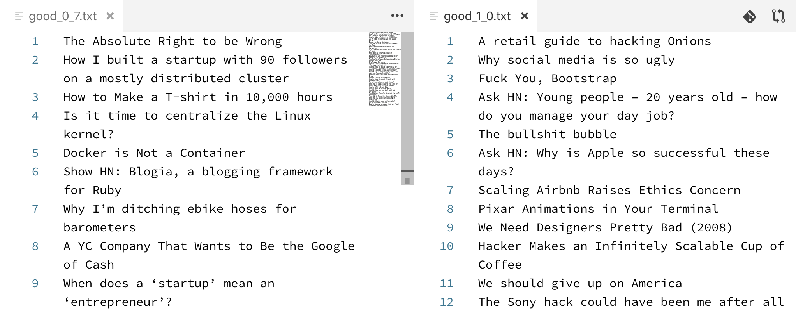

# hacker-news-gpt-2



Dump of generated texts from [gpt-2-simple](https://github.com/minimaxir/gpt-2-simple) trained on Hacker News titles until April 25th, 2019 (about 603k titles, 30MB of text) for 36,813 steps (12 hours w/ a P100 GPU, costing ~$6). The output is *definitely* not similar to that of Markov chains.

For each temperature, there are 20 dumps of 1,000 titles (you can see some good curated titles in the `good_XXX.txt` files). The higher the temperature, the crazier the text.

* `temp_0_7`: Normal and syntactically correct, but the AI sometimes copies existing titles verbatim. I recommend checking against HN Search.
* `temp_1_0`: Crazier, mostly syntactically correct. Funnier IMO. Almost all titles are unique and have not been posted on HN before.
* `temp_1_3`: Even more crazy, occasionally syntactically correct.

## How To Get the Text and Train the Model

The Hacker News titles were retrieved from BigQuery (w/ [a trick](https://stackoverflow.com/questions/7394748/whats-the-right-way-to-decode-a-string-that-has-special-html-entities-in-it/29824550#29824550) to decode HTML entities that occasionally clutter BQ data):

```sql
CREATE TEMPORARY FUNCTION HTML_DECODE(enc STRING)
RETURNS STRING
LANGUAGE js AS """
var decodeHtmlEntity = function(str) {
  return str.replace(/&#(\\d+);/g, function(match, dec) {
    return String.fromCharCode(dec);
  });
};
  try { 
    return decodeHtmlEntity(enc);;
  } catch (e) { return null }
  return null;
""";

SELECT HTML_DECODE(title)
FROM `bigquery-public-data.hacker_news.full`
WHERE type = 'story'
AND timestamp < '2019-04-25'
AND score >= 5
ORDER BY timestamp
```

The file was exported as a CSV, uploaded to a GCP VM w/ P100 (120s / 100 steps), then converted to a gpt-2-simple-friendly TXT file via `gpt2.encode_csv()`.

The training was initiated with the CLI command `gpt_2_simple finetune csv_encoded.txt`, and the files were generated with the CLI command `gpt_2_simple generate --temperature XXX --nsamples 1000 --batch_size 25 --length 100 --prefix "<|startoftext|>" --truncate "<|endoftext|>" --include_prefix False --nfiles 10`. The generated files were then downloaded locally.

## Maintainer/Creator

Max Woolf ([@minimaxir](https://minimaxir.com))

## License

MIT